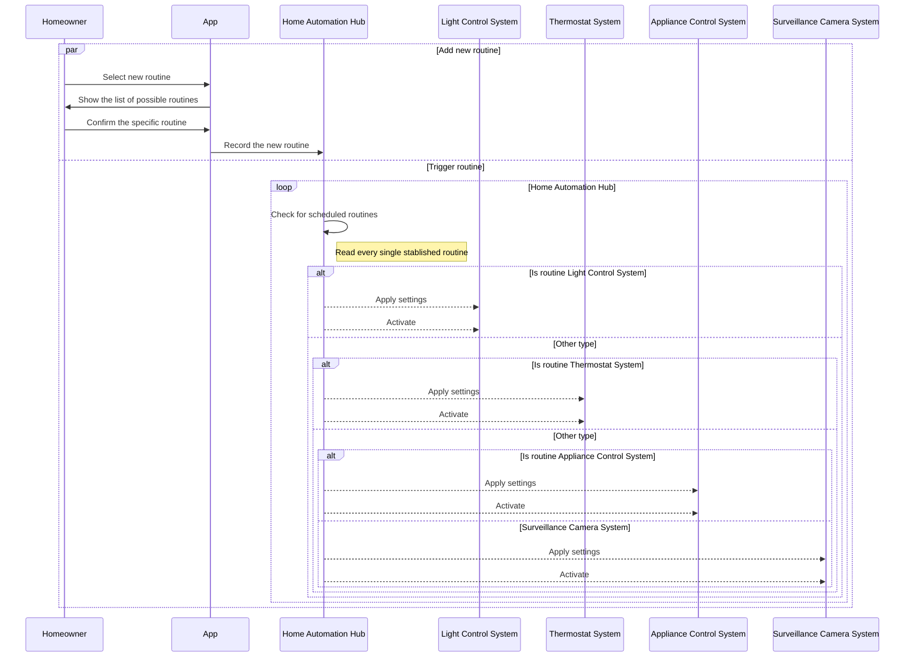

# Overview
A sequence diagram is a type of UML diagram that shows how entities operate with one another and in what order. A sequence diagram shows object interactions arranged in time sequence, which is crucial for understanding the dynamic behavior of the system.

# Instructions and Requirements
In this assignment, you will create a sequence diagram for a Smart Home Automation scenario.

For the sequence placeholders, the sequences will need to feature the following:

- alternate pathing (if/else)
- parallellism (asynchronous sequences)
- looping
- self call (self referencing)

# Scenario
Smart Home Automation System
Entities:

- Homeowner
- Smart Home App
- Voice Assistant
- Light Control System
- Thermostat System
- Security System
- Door Lock System
- Surveillance Camera System
- Home Automation Hub
- Appliance Control System
- Placeholder for additional systems
- Placeholder for additional systems
- Placeholder for additional systems

## Sequence 1: 

Morning Routine Automation
- **Triggering Automation**: <u>Homeowner</u> schedules a morning routine through the <u>Smart Home App</u>, and the <u>App</u> communicates with the <u>Home Automation Hub</u> to initiate the routine.
- **Light and Temperature Adjustments**: The <u>Home Automation Hub</u> sends a command to the <u>Light Control System</u> to gradually increase brightness, and the <u>Thermostat System</u> adjusts to the preferred morning temperature.
- **Appliance Activation**: The <u>Appliance Control System</u> turns on the coffee maker and other appliances as scheduled.
- **Security System Monitoring**: <u>Surveillance Camera System</u> records outdoor movement while the Door Lock System remains secure.
- **Status Updates**: The <u>Homeowner</u> receives a routine completion notification from the <u>App</u>.

## Sequence Diagrama - Morning Routine Automation
