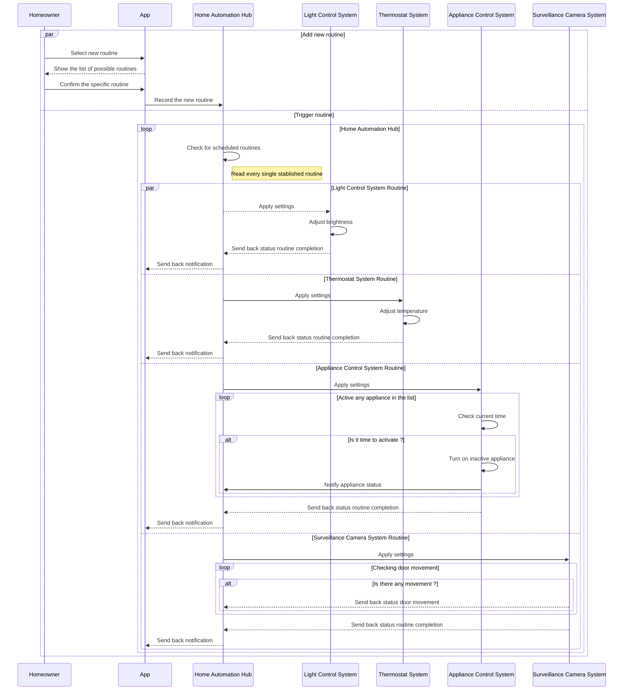
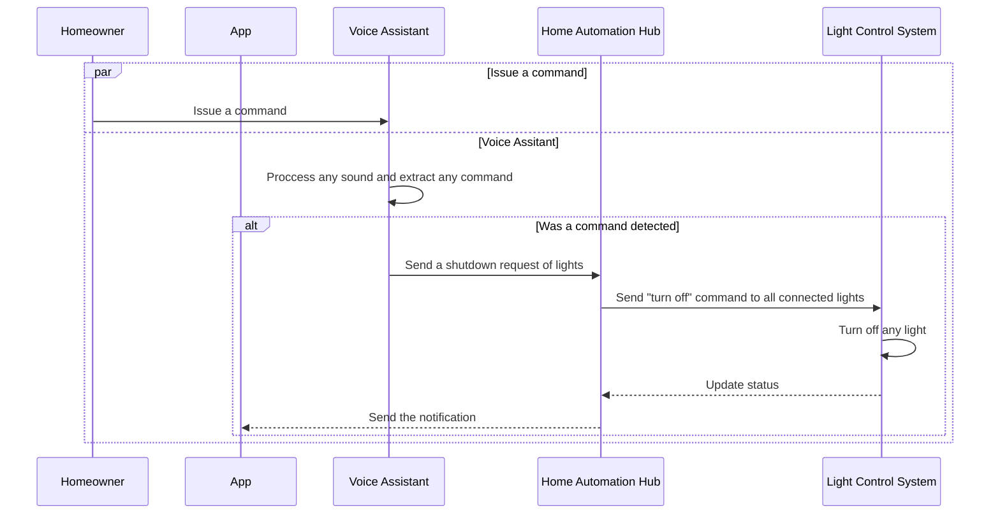

# Overview
A sequence diagram is a type of UML diagram that shows how entities operate with one another and in what order. A sequence diagram shows object interactions arranged in time sequence, which is crucial for understanding the dynamic behavior of the system.

# Instructions and Requirements
In this assignment, you will create a sequence diagram for a Smart Home Automation scenario.

For the sequence placeholders, the sequences will need to feature the following:

- alternate pathing (if/else)
- parallellism (asynchronous sequences)
- looping
- self call (self referencing)

# Scenario
Smart Home Automation System
Entities:

- Homeowner
- Smart Home App
- Voice Assistant
- Light Control System
- Thermostat System
- Security System
- Door Lock System
- Surveillance Camera System
- Home Automation Hub
- Appliance Control System
- Placeholder for additional systems
- Placeholder for additional systems
- Placeholder for additional systems

## Sequence 1: 

Morning Routine Automation
- **Triggering Automation**: _Homeowner_ schedules a morning routine through the _Smart Home App_, and the _App_ communicates with the _Home Automation Hub_ to initiate the routine.
- **Light and Temperature Adjustments**: The _Home Automation Hub_ sends a command to the _Light Control System_ to gradually increase brightness, and the _Thermostat System_ adjusts to the preferred morning temperature.
- **Appliance Activation**: The _Appliance Control System_ turns on the coffee maker and other appliances as scheduled.
- **Security System Monitoring**: _Surveillance Camera System_ records outdoor movement while the Door Lock System remains secure.
- **Status Updates**: The _Homeowner_ receives a routine completion notification from the _App_.

## Sequence Diagram - Morning Routine Automation

## Sequence 6:  Light Control Shutdown

This simple case illustrates how a homeowner can easily turn off all lights in a smart home using voice commands

**Initiate Shutdown Command**: The _Homeowner_ issue a command "Turn off all lights" through his or her voice.

**Voice Activation**: The _Voice Assistance_ is listening and processing every sound that it catches.

**Command Processing**: The _Voice Assistant_ processes the command and sends a shutdown request to the _Home Automation Hub_.

**Relay Command to Light Control System**:

The _Home Automation Hub_ receives the request and relays the command to the _Light Control System_.

**Execute Shutdown**: The _Light Control System_ turns off all connected lights.

**Status Update**: The _Light Control System_ sends a confirmation back to the Home Automation Hub that all lights have been turned off.

**Notification**: The _Home Automation Hub_ can notify the _Smart Home App_ or the Voice Assistant of the successful shutdown, confirming to the Homeowner that all lights are off.

## Sequence Diagram - Light Control Shutdown

