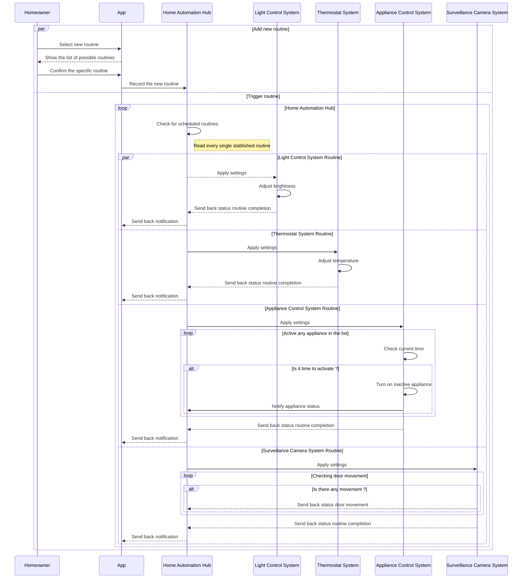
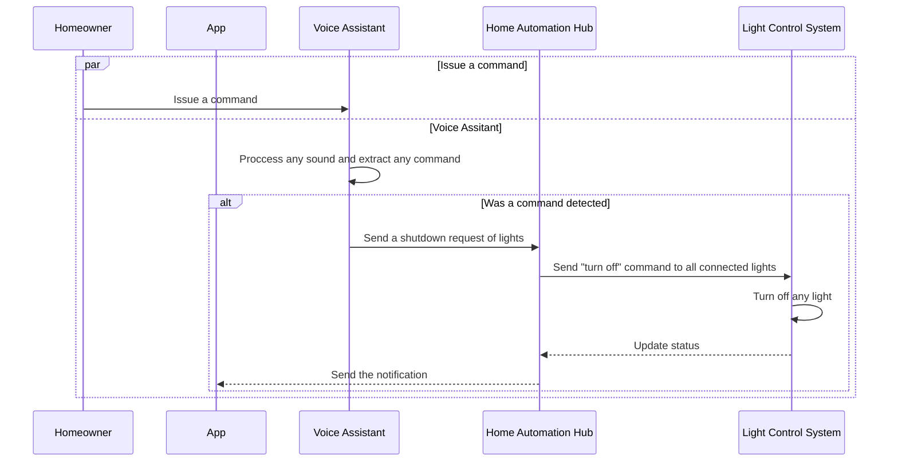
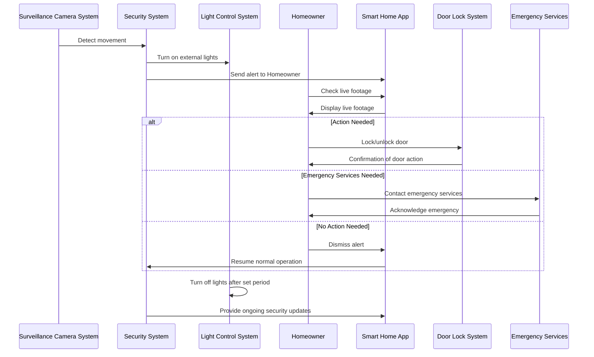
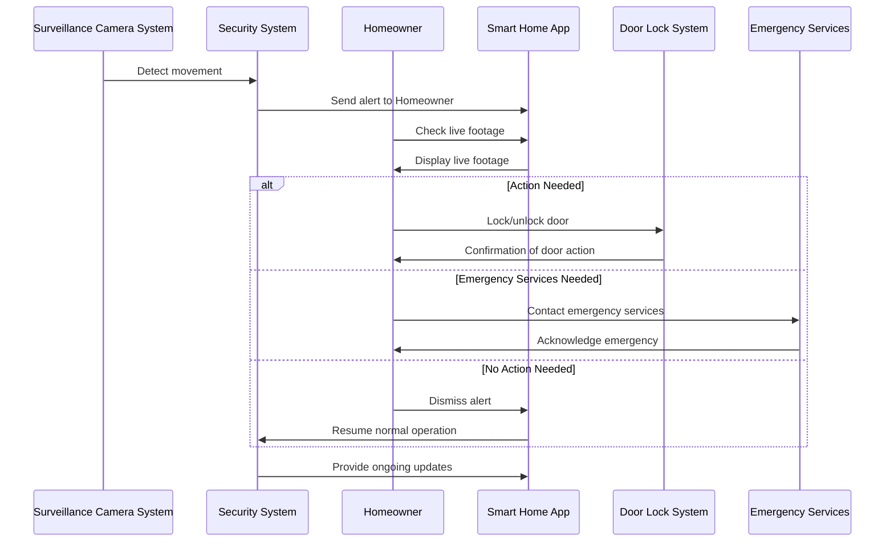

# Overview
A sequence diagram is a type of UML diagram that shows how entities operate with one another and in what order. A sequence diagram shows object interactions arranged in time sequence, which is crucial for understanding the dynamic behavior of the system.

# Instructions and Requirements
In this assignment, you will create a sequence diagram for a Smart Home Automation scenario.

For the sequence placeholders, the sequences will need to feature the following:

- alternate pathing (if/else)
- parallellism (asynchronous sequences)
- looping
- self call (self referencing)

# Scenario
Smart Home Automation System
Entities:

- Homeowner
- Smart Home App
- Voice Assistant
- Light Control System
- Thermostat System
- Security System
- Door Lock System
- Surveillance Camera System
- Home Automation Hub
- Appliance Control System
- Placeholder for additional systems
- Placeholder for additional systems
- Placeholder for additional systems

## Sequence 1: 

Morning Routine Automation
- **Triggering Automation**: _Homeowner_ schedules a morning routine through the _Smart Home App_, and the _App_ communicates with the _Home Automation Hub_ to initiate the routine.
- **Light and Temperature Adjustments**: The _Home Automation Hub_ sends a command to the _Light Control System_ to gradually increase brightness, and the _Thermostat System_ adjusts to the preferred morning temperature.
- **Appliance Activation**: The _Appliance Control System_ turns on the coffee maker and other appliances as scheduled.
- **Security System Monitoring**: _Surveillance Camera System_ records outdoor movement while the Door Lock System remains secure.
- **Status Updates**: The _Homeowner_ receives a routine completion notification from the _App_.

## Sequence Diagram - Morning Routine Automation

## Sequence 6:  Light Control Shutdown

This simple case illustrates how a homeowner can easily turn off all lights in a smart home using voice commands

**Initiate Shutdown Command**: The _Homeowner_ issue a command "Turn off all lights" through his or her voice.

**Voice Activation**: The _Voice Assistance_ is listening and processing every sound that it catches.

**Command Processing**: The _Voice Assistant_ processes the command and sends a shutdown request to the _Home Automation Hub_.

**Relay Command to Light Control System**:

The _Home Automation Hub_ receives the request and relays the command to the _Light Control System_.

**Execute Shutdown**: The _Light Control System_ turns off all connected lights.

**Status Update**: The _Light Control System_ sends a confirmation back to the Home Automation Hub that all lights have been turned off.

**Notification**: The _Home Automation Hub_ can notify the _Smart Home App_ or the Voice Assistant of the successful shutdown, confirming to the Homeowner that all lights are off.

## Sequence Diagram - Light Control Shutdown

# Sequence #: Enhanced Home Security Alert with Light Control Shutdown
This scenario combines the security features of motion detection with smart lighting to enhance home security during the night.
When movement is detected outside the house, external lights are activated, the homeowner is alerted, and they can take actions such as viewing live footage, locking or unlocking doors, or dismissing the alert if no action is needed.

Entities:
- Surveillance Camera System
- Security System
- Homeowner
- Smart Home App
- Door Lock System
- Light Control System (+)
- Emergency Services (+)

# Sequence
1. **Movement detection:** The **Surveillance Camera System** detects movement and triggers the **Security System.**
2. **Lighting control:** The **Security System** activates the **Light Control System**, which turns on external lights to improve visibility outside.
3. **Alerting the homeowner:** The **Security System** sends an alert to the **Homeowner** via the **Smart Home App**, and the **Homeowner** checks the live footage to assess the situation.
4. **Decision-making:** The **Homeowner** has three possible actions:
  - **No action:** If it's a false alarm, they can dismiss the alert.
  - **Lock/unlock door:** If the **Homeowner** deems it necessary, they can lock or unlock doors using the **Door Lock System**, and receive confirmation.
  - **Contact emergency services:** The **Homeowner** can contact the police or emergency services, who will acknowledge the request.
5. **Lights turn off:** After a set period of inactivity, the **Light Control System** automatically turns off the external lights unless more movement is detected.
6. **Ongoing updates:** The **Security System** continues to monitor and provide updates to the **Homeowner** via the **Smart Home App.**

## Sequence: Enhanced Home Security Alert with Nighttime Lighting Control

## Sequence 3: Home Security Alert

### Entities
- Surveillance Camera System
- Security System
- Homeowner
- Smart Home App
- Door Lock System
- Emergency Services (+)

## Sequence:

1. **Surveillance Camera System** detects movement near the door and sends a signal to the **Security System**.
2. **Security System** sends an alert to the **Homeowner** via the **Smart Home App**.
3. **Homeowner** checks live footage using the **Smart Home App**.
4. **Homeowner** decides:
  - If no action is required, the system resumes normal operation.
  - If action is needed, the **Homeowner** chooses to lock/unlock the door or contact emergency services.
5. If the **Homeowner** locks/unlocks the door, the **Door Lock System** carries out the command and sends a confirmation back to the **Homeowner**.
6. If emergency services are contacted, the **Smart Home App** provides necessary information to the authorities.
7. The **Homeowner** receives ongoing updates from the Security System as the situation develops.

### Sequence Diagram - Home Security Alert

